# Launch Game
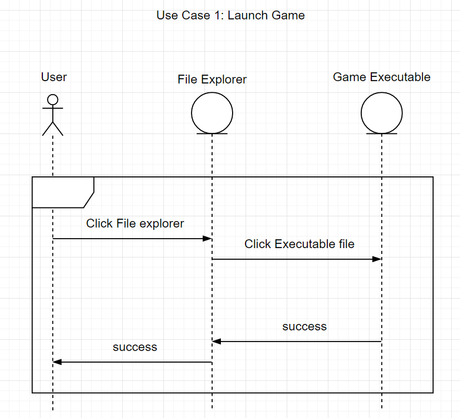

# Main Menu

# Online Menu Display
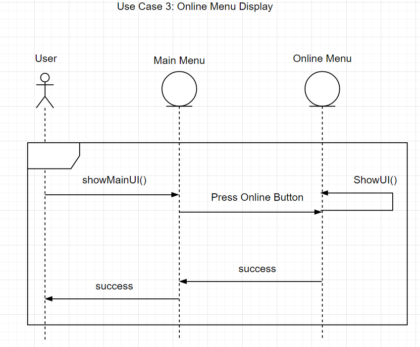

# Open options
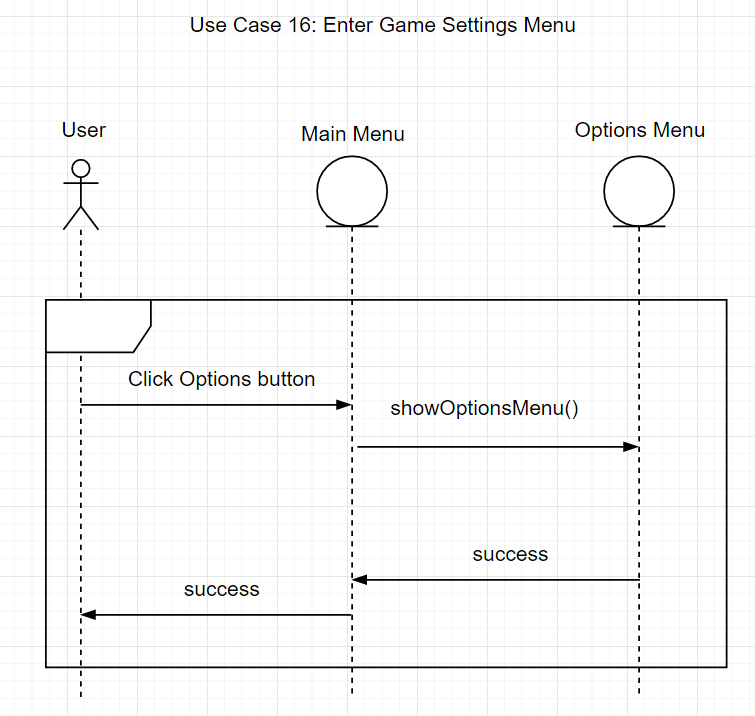

# Host a Lobby
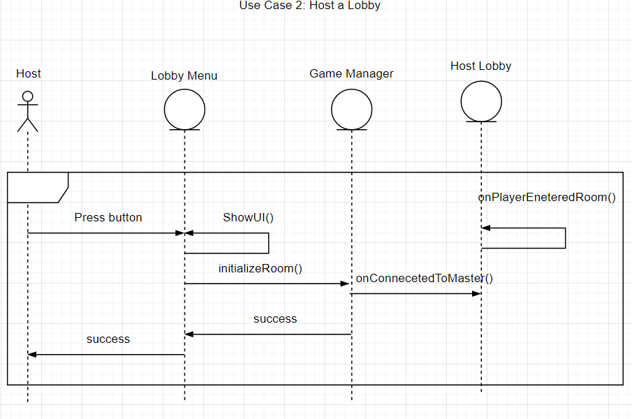

# Connect To Lobby
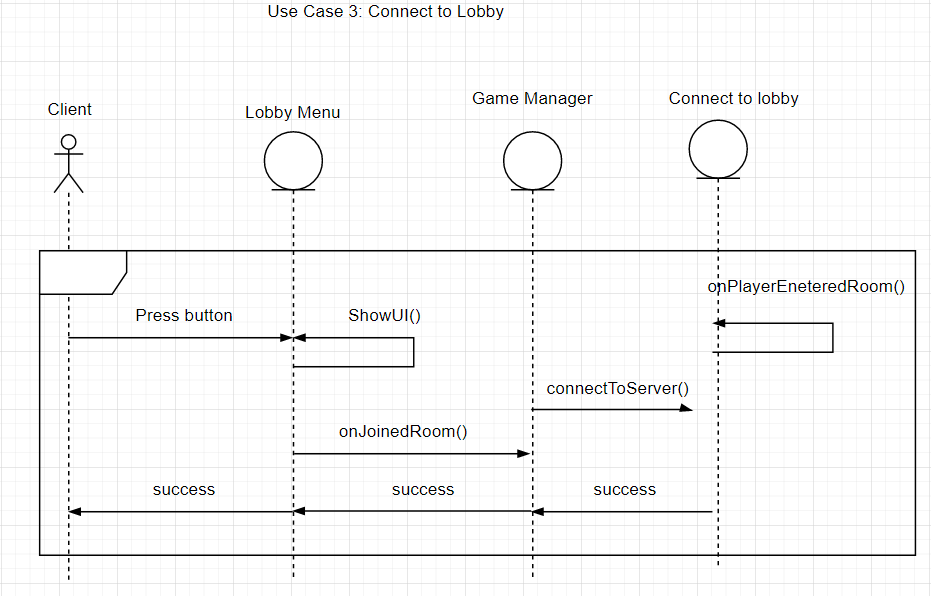

# Disconnect To Lobby
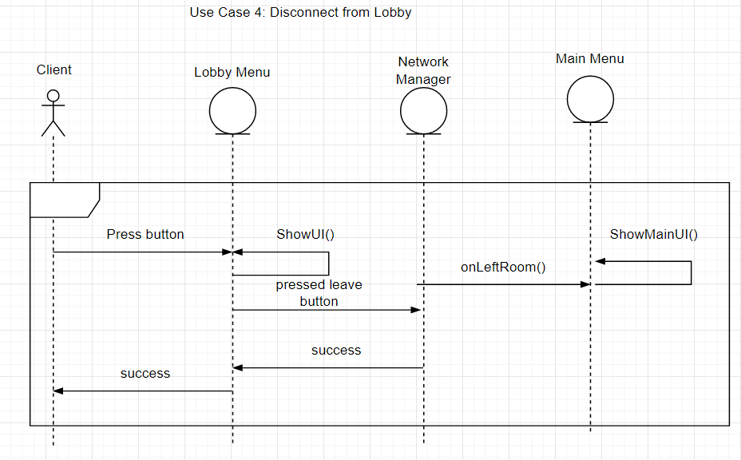

# Close Lobby
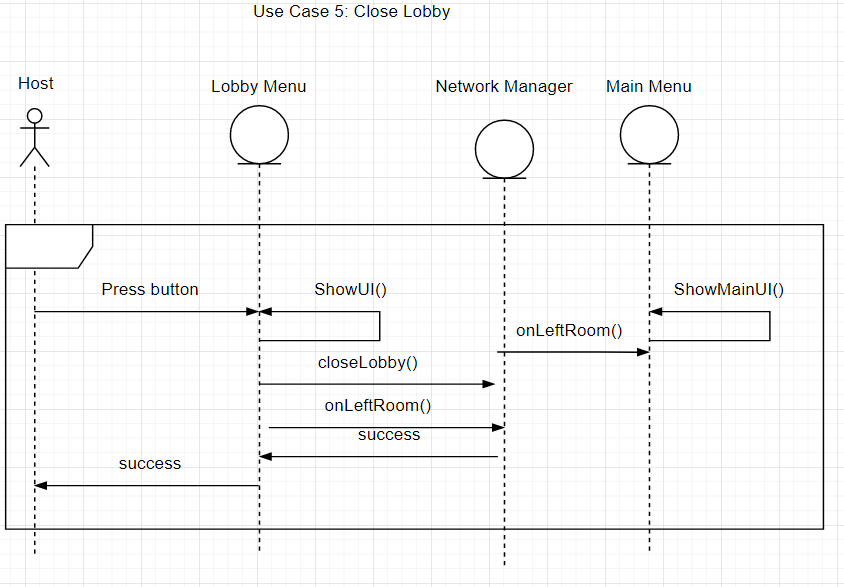

# Start Game
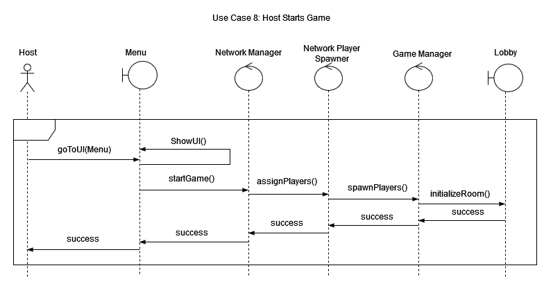

# Start Timer
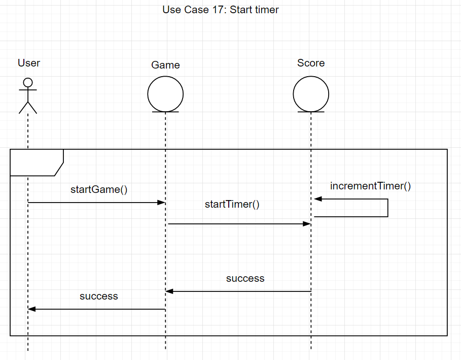

# Player spawn in game
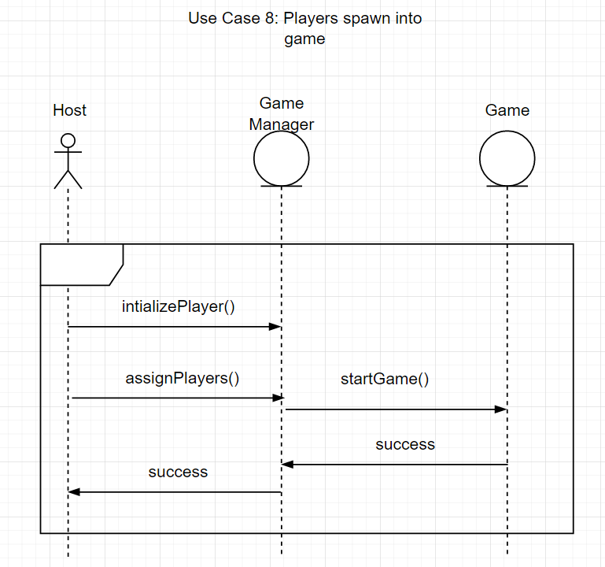

# Snowball hit player
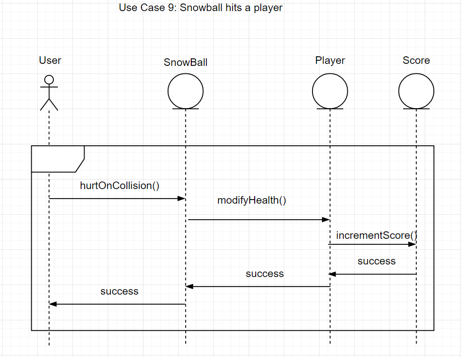

# Player grabs snowball
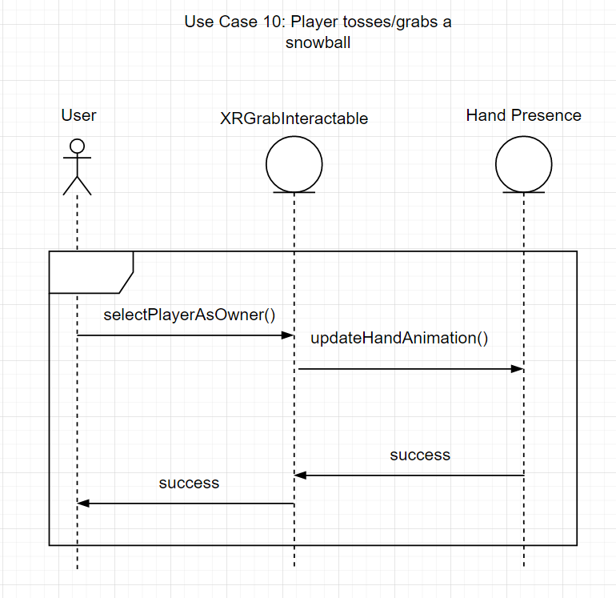

# Reload snowball
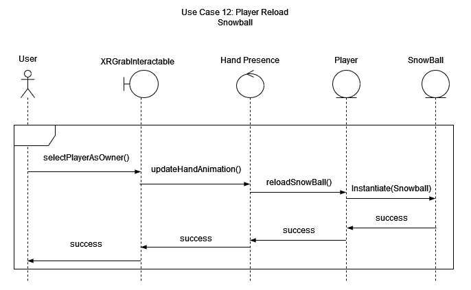

# Movement
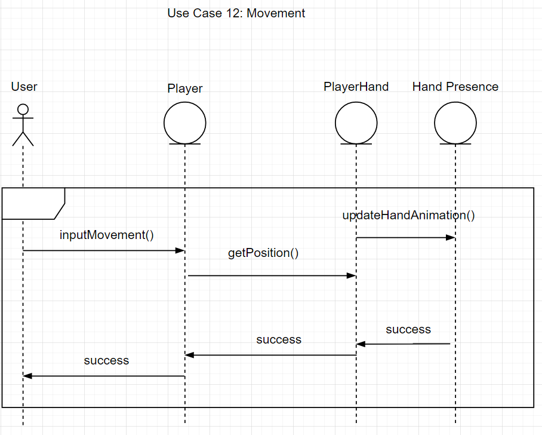

# End Game
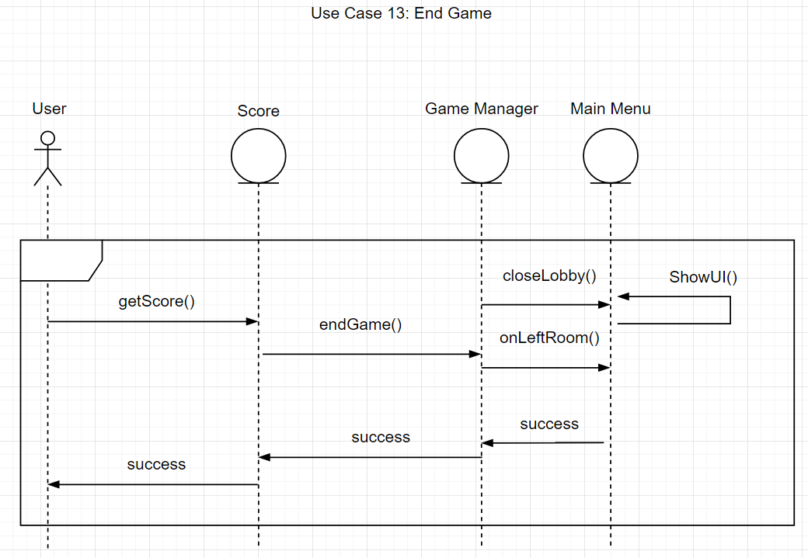

# Return to menu

# Close Game

