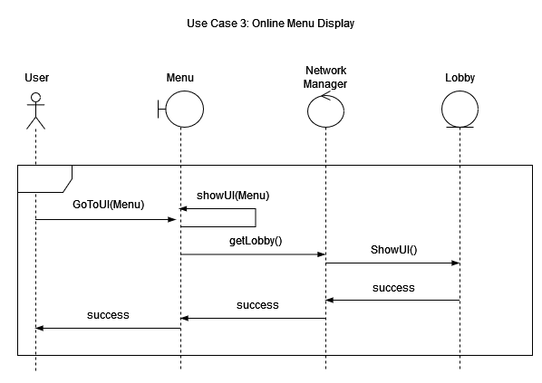
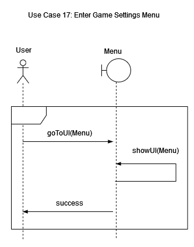
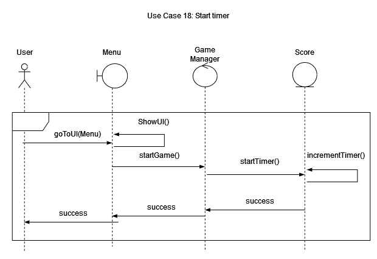
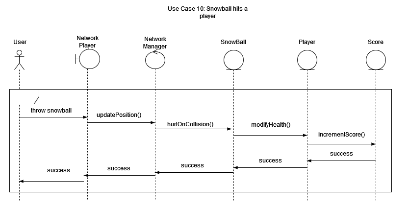
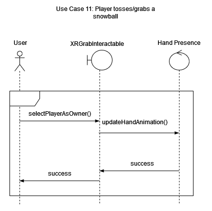
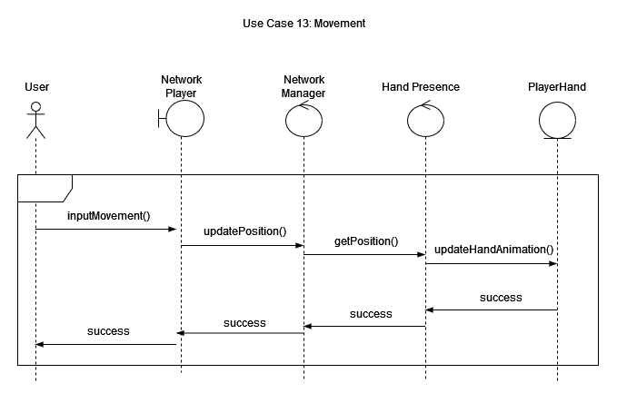
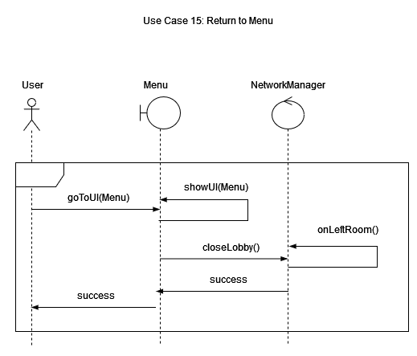
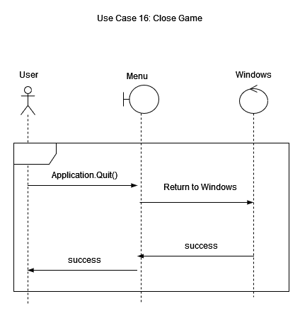

# Launch Game

# Main Menu

# Online Menu Display

# Open options

# Host a Lobby

# Connect To Lobby

# Disconnect To Lobby

# Close Lobby

# Start Game

# Start Timer

# Player spawn in game

# Snowball hit player

# Player grabs snowball

# Reload snowball

# Movement

# End Game

# Return to menu

# Close Game

